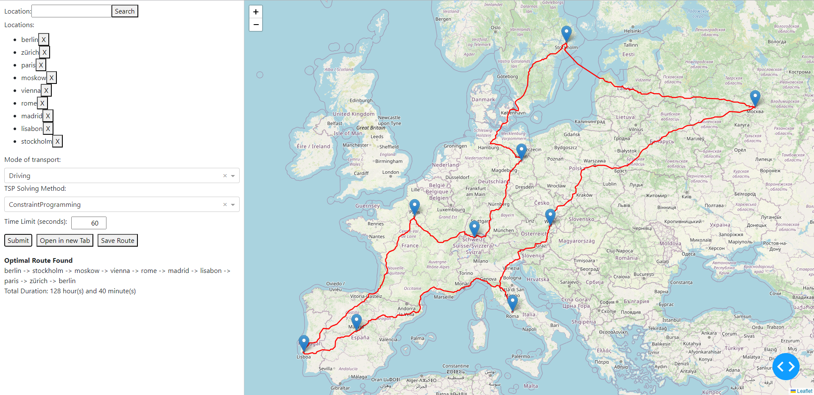

Traveling Salesman Problem (TSP) Solver
=======================================

Introduction
------------
This project provides various algorithms and methods to solve the classic Traveling Salesman Problem (TSP).
The implementation took place as part of a Project at **HSLU (Lucerne School of Information Technology)** to function as visual tool for the Modul of Industrial Optimization.

Many Thanks go to **Reinhard Bürgy** who came up with the project.

API Key generation
------------------
To use the App, you'll need a Free OpenRouteService API Key. 

**Steps to generate one:**

1. Visit the [OpenRouteService Sign Up page](https://openrouteservice.org/sign-up/).
2. Create an account or sign in if you already have one.
3. Once logged in, navigate to the Dashboard --> "Tokens" section.
4. Here, you can create a new API token or manage existing ones.

Now you can paste it in the `API_KEY.txt` file

Existing TSP Solving Methods
-----------------------------
The project currently incorporates methods such as `TwoOpt`, `Permutation`, `FlowBased`, and `ConstraintProgramming`.

Adding a New TSP Solving Method
-------------------------------
1. **Define the New Method**: 
    - Create a new class for your method in `tsp_logic.py` and make sure it inherits from interface TSPMethod.
    - Ensure your class has a `solve` method that accepts a cost matrix as input and returns the solution (tour) for the TSP. Make sure that in the end you return to the original position.
2. **Update the TSPMethodFactory**:
    - Modify the `TSPMethodFactory` class to handle the creation of an instance of your new method based on its name.
3. **GUI Integration**: 
    - To make your method available as an option on the dash website, add its name to the `dcc.Dropdown` list in `dash.py`. Ensure consistency with the name used in the Factory.

Contributing
------------
To contribute to this project, ensure that any new methods or changes are thoroughly tested and documented. Bugfixes and improvments as well as new Methods are welcome.

Important to know
-----------------
To run the app, run the app.py file after cloning the repository.
In case the location you try to add shares their name with another place, you an add as many details to specify the locations as you want. For example: "example City name, example State name, example Country" just like you would in google maps.

